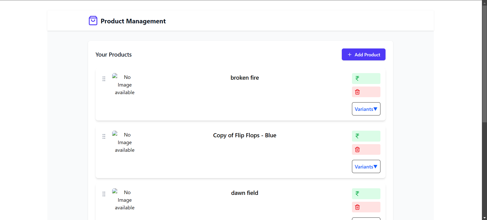
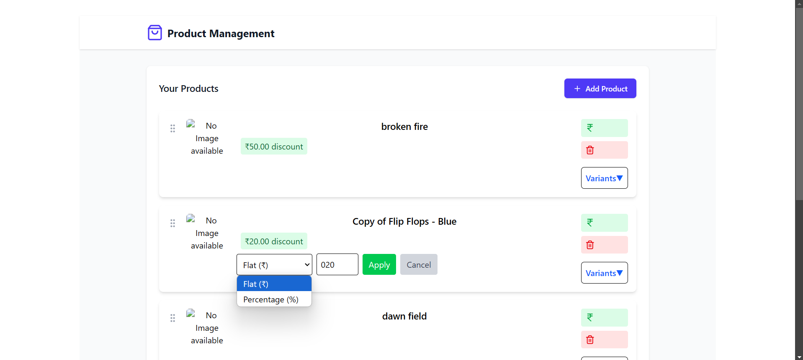
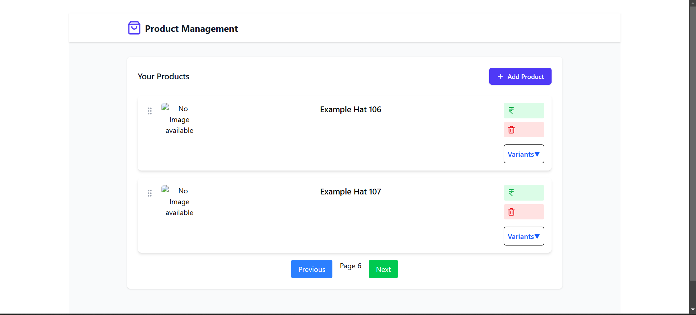
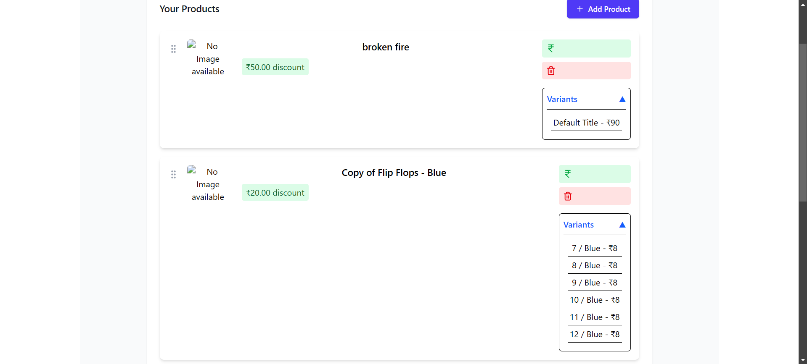
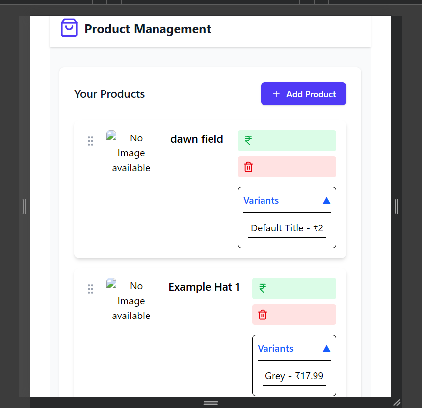

# Product Listing - React.js

This project is a **Product Management Application** built using **React.js**. It allows users to search, add, remove, update, and manage products efficiently. The app also supports **pagination, drag-and-drop sorting, and discount calculation**.

## Live Demo

🔗 [Live Link](https://your-live-link.com)

## Application Preview 📸

You can check out all the screenshots in the [`results/`](./src/results/) folder.

<details>
<summary> Click to see the screenshots / Preview Images of the application in different views </summary>

### Home Page



### Price Update



### Pagination



### Variants Accordion



### Responsive Design



</details>

## Approach

The application follows a **modular approach** by splitting functionalities into different components and using React Context for state management.

- **React Query** is used for efficient API data fetching and caching.
- **React DnD** enables drag-and-drop functionality for product reordering.
- **Tailwind CSS** is used for styling.

## Tech Stack

- **Frontend**: React.js, React Query, React DnD
- **State Management**: Context API
- **Styling**: Tailwind CSS
- **Icons**: Lucide-react

## Setup Instructions

Follow these steps to set up the project on your local machine:

1. **Clone the repository**

```bash
   git clone <repository-url>
```

2. **Navigate to the project directory**

```bash
   cd Product-Listing-Reactjs
```

3. **Install dependencies**

```bash
   npm install
```

4. **Create a .env file**

```bash
   VITE_API_BASE_URL='https://dummyjson.com/products'

   VITE_API_KEY='your-api-key'
```

4. **Start the development server**

```bash
   npm start
```

5. **Open the app in the browser**

```
   http://localhost:5173/
```

## Features

✅ Fetch and display products from API  
✅ Add, Remove, and Update products  
✅ Apply discounts (flat & percentage-based)  
✅ Pagination for efficient data handling  
✅ Drag-and-drop sorting functionality  
✅ Variants accordion to manage different product versions

---

### Future Improvements

- Add authentication & user roles
- Improve UI/UX with animations
- Optimize API calls using caching techniques
